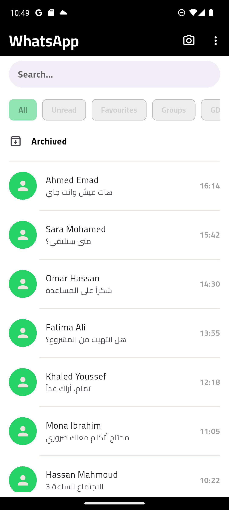
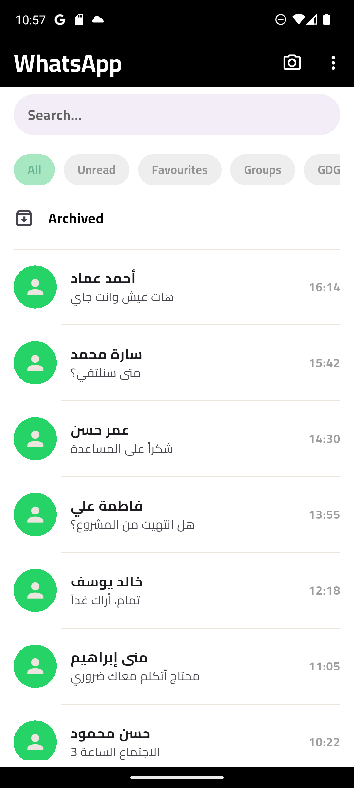
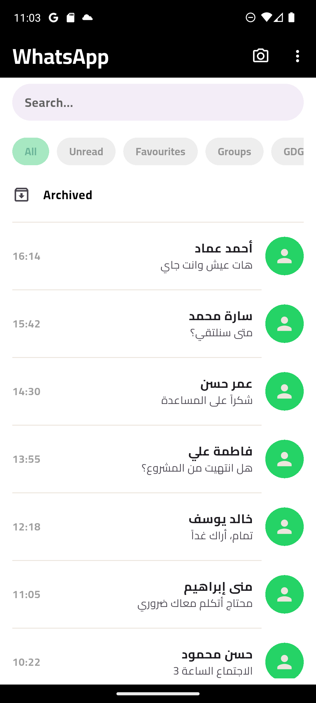
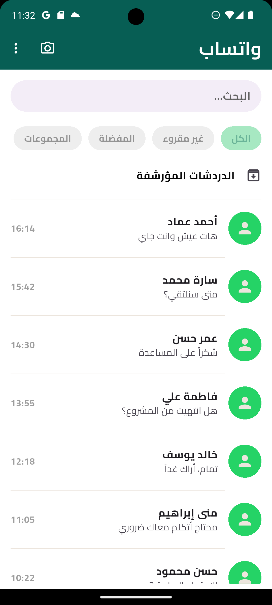

# 💬 WhatsApp UI Clone

A beautiful and modern WhatsApp UI clone built with Flutter, featuring a pixel-perfect recreation of the messaging interface with smooth animations and responsive design.


## 📱 Screenshots

<div align="center">
  
  
  
  
</div>

## ✨ Features

- 🎨 **Pixel-Perfect Design** - Faithful recreation of WhatsApp's modern UI
- 🌙 **Beautiful Interface** - Clean and intuitive user experience
- 📱 **Responsive Layout** - Adapts seamlessly to different screen sizes
- 🇦🇪 **RTL Support** - Full support for Arabic and RTL languages
- ⚡ **Smooth Animations** - Fluid transitions and interactions
- 🎯 **Material Design** - Following Flutter's Material Design principles
- 🔐 **Authentication System** - Complete login and signup flow
- 🏗️ **Clean Architecture** - Feature-based modular structure

## 🚀 Getting Started

### Prerequisites

- Flutter SDK (>=3.0.0)
- Dart SDK (>=3.0.0)
- Android Studio / VS Code
- An Android or iOS device/emulator

### Installation

1. **Clone the repository**
   ```bash
   git clone https://github.com/ahmedalaayq/whatsapp-ui-clone.git
   cd whatsapp-ui-clone
   ```

2. **Install dependencies**
   ```bash
   flutter pub get
   ```

3. **Run the app**
   ```bash
   flutter run
   ```

## 📂 Project Structure

```
lib/
├── main.dart                              # App entry point
│
├── core/                                  # Core functionality
│   ├── theme/
│   │   ├── app_theme.dart                # Main theme configuration
│   │   ├── app_colors.dart               # Color palette
│   │   ├── app_text_styles.dart          # Typography system
│   │   └── app_fonts.dart                # Font configuration
│   │
│   ├── routers/
│   │   └── app_routes.dart               # Route constants
│   │
│   └── helper_functions/
│       └── on_generate_routes.dart       # Route generation logic
│
└── features/                              # Feature modules
    │
    ├── auth/                              # Authentication feature
    │   ├── login/
    │   │   └── presentation/
    │   │       └── views/
    │   │           ├── login_view.dart
    │   │           └── widgets/
    │   │               ├── login_view_body.dart
    │   │               └── custom_text_form_field.dart
    │   │
    │   └── signup/
    │       └── presentation/
    │           └── views/
    │               ├── sign_up_view.dart
    │               └── widgets/
    │                   └── sign_up_view_body.dart
    │
    └── gdg/                               # WhatsApp UI feature
        ├── login_view.dart
        ├── whatsapp_view.dart             # Main WhatsApp screen
        └── widgets/
            ├── custom_app_bar.dart        # Custom app bar widget
            ├── whatsapp_category_item.dart
            ├── whatsapp_chat_body.dart    # Chat body container
            └── whatsapp_chat_body_list.dart # Chat list widget

assets/
└── screenshots/                           # App screenshots
    ├── Screenshot_1765054191.png
    ├── Screenshot_1765054626.png
    ├── Screenshot_1765055027.png
    └── Screenshot_1765056730.png
```

## 🏗️ Architecture

This project follows **Clean Architecture** principles with a **feature-based** modular structure:

### Core Layer
- **Theme**: Centralized theme configuration including colors, text styles, and fonts
- **Routers**: Navigation and routing management
- **Helper Functions**: Utility functions and route generation

### Features Layer
Each feature is self-contained with its own structure:

- **auth**: Authentication module with login and signup
  - Follows presentation layer pattern
  - Reusable custom widgets
  
- **gdg**: WhatsApp UI implementation
  - Main view and sub-widgets
  - Custom app bar and chat components

## 🛠️ Built With

- **[Flutter](https://flutter.dev/)** - UI framework
- **[Dart](https://dart.dev/)** - Programming language
- **Material Design** - Design system

## 🎯 Key Components

### Authentication System
- Custom text form fields with validation
- Login and signup screens
- Clean separation of concerns

### WhatsApp UI
- **Custom App Bar**: Tailored app bar with search and menu
- **Chat Body**: Main container for chat interface
- **Chat List**: Scrollable list of conversations
- **Category Items**: Tab-based navigation

### Theme System
- Centralized color management
- Typography system with custom text styles
- Dark/Light theme support ready
- Custom font integration

## 📝 Code Architecture

```dart
// Example: Feature Structure
features/
  └── feature_name/
      ├── data/              # Data layer (API, models, repositories)
      ├── domain/            # Business logic (entities, use cases)
      └── presentation/      # UI layer (views, widgets, state management)
          ├── views/
          │   ├── feature_view.dart
          │   └── widgets/
          │       └── feature_widget.dart
```

## 🌟 Implemented Features

### Authentication
- ✅ Login screen with form validation
- ✅ Signup screen with user registration
- ✅ Custom text form fields
- ✅ Route-based navigation

### WhatsApp UI
- ✅ Chat list with recent conversations
- ✅ Custom app bar with actions
- ✅ Category navigation
- ✅ Responsive design

### Core System
- ✅ Centralized theme management
- ✅ Route generation system
- ✅ Reusable components
- ✅ Clean architecture structure

## 🔮 Future Enhancements

- [ ] State management (Bloc/Riverpod)
- [ ] Backend integration with Firebase
- [ ] Real-time messaging
- [ ] Media sharing functionality
- [ ] Voice and video call UI
- [ ] Group chat interface
- [ ] Profile customization
- [ ] Message reactions and replies
- [ ] Story creation and viewing
- [ ] Dark mode implementation
- [ ] Localization support

## 📱 Screens Overview

1. **Login Screen** - User authentication
2. **Signup Screen** - New user registration
3. **WhatsApp Home** - Main chat list
4. **Chat Screen** - Individual conversations
5. **Status/Stories** - User stories view

## 🎨 Design System

### Colors
Centralized in `app_colors.dart` for easy theme management

### Typography
Custom text styles defined in `app_text_styles.dart`

### Fonts
Custom fonts configured in `app_fonts.dart`

## 🤝 Contributing

Contributions are what make the open-source community such an amazing place to learn, inspire, and create. Any contributions you make are **greatly appreciated**.

1. Fork the Project
2. Create your Feature Branch (`git checkout -b feature/AmazingFeature`)
3. Commit your Changes (`git commit -m 'Add some AmazingFeature'`)
4. Push to the Branch (`git push origin feature/AmazingFeature`)
5. Open a Pull Request

## 📄 License

This project is licensed under the MIT License - see the [LICENSE](LICENSE) file for details.

## 👨‍💻 Author

**Ahmed Alaayq**
- GitHub: [@ahmedalaayq](https://github.com/ahmedalaayq)
## 🙏 Acknowledgments

- Inspired by [WhatsApp](https://www.whatsapp.com/)
- Flutter community for amazing packages and support
- Material Design guidelines
- Clean Architecture principles by Robert C. Martin

## 📞 Support

If you like this project, please ⭐ star this repository and share it with others!

For questions or support, please open an issue or reach out via email.

---

<div align="center">
  Made with Ahmed Emad ❤️ 
</div>
